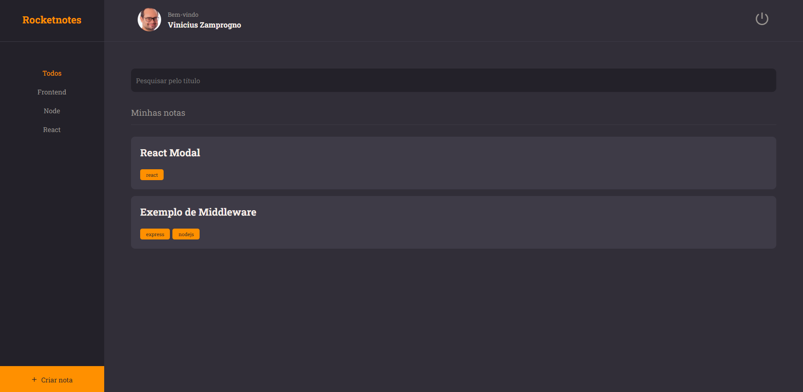

<h1 align="center"> Rocketnotes - FrontEnd</h1>

Rocketnotes - Frontend

  <a href="#-tecnologias">Tecnologias</a>&nbsp;&nbsp;&nbsp;|&nbsp;&nbsp;&nbsp;
  <a href="#-projeto">Projeto</a>&nbsp;&nbsp;&nbsp;
  

 

  

## 🚀 Tecnologias

Esse projeto foi desenvolvido com as seguintes tecnologias:

- HTML e CSS
- JavaScript
- Figma
- ReactJS

## 💻 Projeto

Frontend desenvolvido durante o Stage 09 no Curso Explorer da Rocketseat. 

---

Feito com ♥ by Vinicius Zamprogno, estudante na Rocketseat 👋
